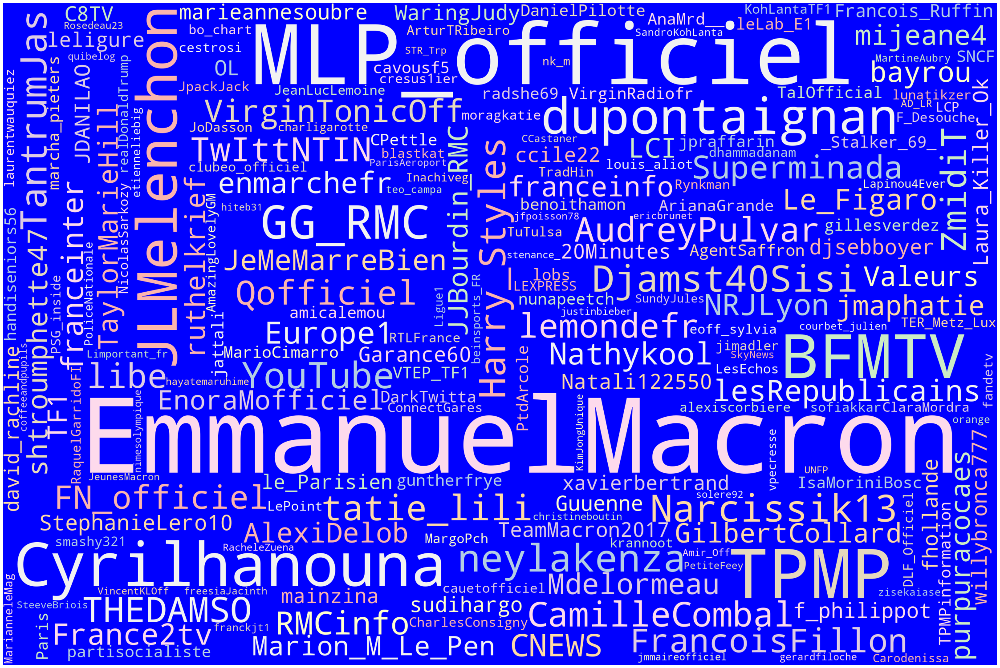
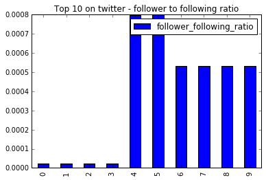
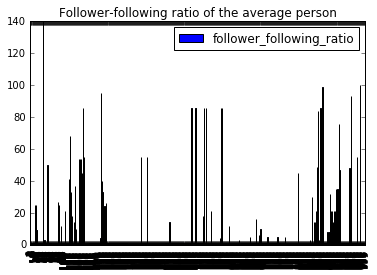
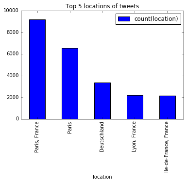

# pyspark-case-study-gav
A case study on the French Presidential Election in 2017, using tweeter data. 

## Data
Orgin: The original data contains follow roughly 1220 columns with over  214 900 rows.  
Now: In the cleaning process we kept the 214 900 row but reduce the columns to 42.

### Data Dictionary
|Column Name |Data Type|Info |
|------------|---------|---- |
|m_id| string| Master ID for all records |
|country| string| Country of tweet |
|country_code| string| Country code|
|favorite_count| string| Number of tweet likes |
|filter_level| string| Comments within comments
|id| string| Tweet id (numeric ?) |
|id_str| string| Tweet id|
|in_reply_to_screen_name| string| Reply to user (@user etc..) |
|in_reply_to_status_id| string| Reply tweet id (numeric ?)|
|in_reply_to_status_id_str| string| Reply tweet id|
|in_reply_to_user_id| string| Reply to user id (numeric ?)|
|in_reply_to_user_id_str| string| Reply to user id|
|lang| string| Tweet language|
|quoted_status_id_str| string| Was tweet a quote|
|retweet_count| string| Tweet number of retweets|
|text| string| Tweet|
|timestamp_ms| string| Time of tweet|  
|quoted_status_id| string| Quote id|
|user_created_at| string| User profile created time|
|user_description| string| Use about me section|
|user_favourites_count| string| Number of tweet user favor|
|user_follow_request_sent| string| Number of follow request user has set|
|user_followers_count| string| Number of followers user have |
|user_following| string| Number of people user is following|
|user_friends_count| string|  Number of user friends |
|user_id| string| User id|
|user_lang| string| User perfered language|
|user_listed_count| string| Number of times user showed up in search|
|user_location| string| Where user is located|
|user_name| string| User name|
|user_screen_name| string| User displayed name|
|user_statuses_count| string| Number of time user change their status|
|user_time_zone| string| Time zone of user|
|hashtags| string| Hashtages used in tweet|

## Country
|Country|Ingagement|
|-------|-----------|
|GG|16|
|GB|20747|
|DE|4510|
|ES|1923|
|FR|179951|
|CH|2983|
|BE|3519|
|JE|41|
|LU|971|

## Hashtags

Hashtags show topics being discussed within the tweets. Below is a wordcloud of the most popular hashtags.

## Mentions

Mentions show specific users being referenced within the tweets. Below we can see the most popular users mentioned. 

# Users 

What attributes do those who have the most followers on Twitter have? 
The following to follower ratio of the 10 most followed people on twitter

The following to follower ratio of an average person

What are the top 5 locations that tweets are sent from?
